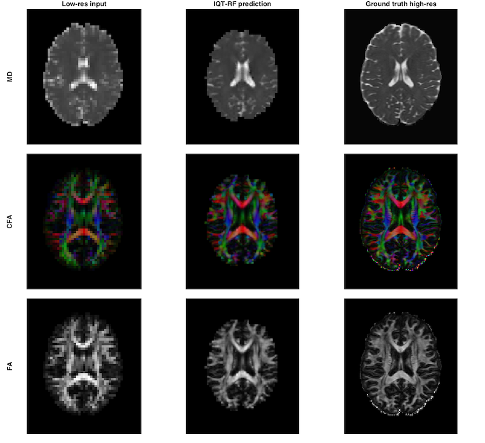
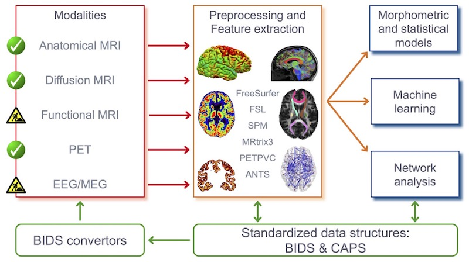
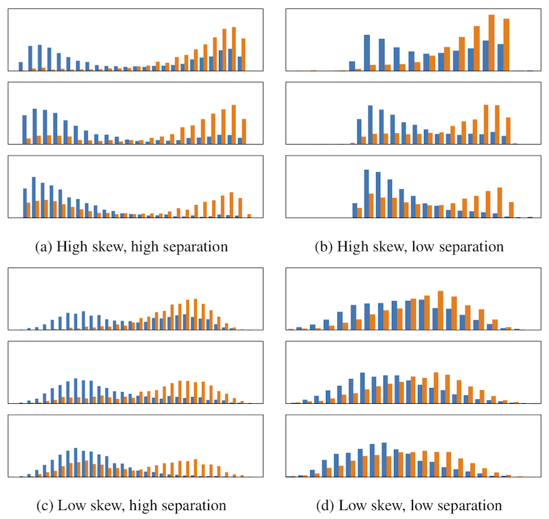
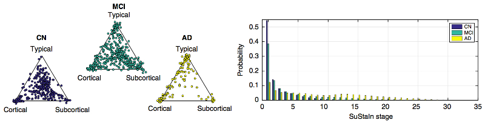

# Merging, Measuring, and Modelling for Neurodegenerative Disease research

Table of Contents
1. [Background](#research-software-tools-with-a-focus-on-brain-circuitsnetworks)
2. [Rationale](#rationale-for-the-merging-measuring-modelling-paradigm)
3. [Merging](#merging) tools
4. [Measuring](#measuring) tools
5. [Modelling](#modelling) tools

## Research software tools with a focus on brain circuits/networks

This toolbox contains work-in-progress research code for [**Merging**](#merging) and harmonizing data, [**Measuring**](#measuring) _in vivo_ brain circuit anatomy and activity, and [**Modelling**](#modelling) neurodegenerative disease progression.

Ultimately we aim to provide a toolbox of research software (as opposed to code) that can _facilitate_ (but not necessarily automate) your own end-to-end analyses of neurodegenerative diseases to reveal insight into disease biology/mechanisms and actionable information for medicine and healthcare.

These tools include scripts and pipelines for building circuit-based (a.k.a., network-based, connectome-based) quantitative signatures of disease progression from large [Imaging Plus X](https://pubmed.ncbi.nlm.nih.gov/28520598/) multimodal data sets.

The toolbox was inspired by the [EuroPOND modelling software toolbox](https://github.com/EuroPOND/europond-software). See also the didactic resources for **Modelling** over in the new [Disease Progression Modelling](https://disease-progression-modelling.github.io) initiative.

### Rationale for the Merging, Measuring, Modelling paradigm
We are interested in big, diverse, data for maximising generalisability and robustness of research findings. So, we envisage including both high-quality data (typically from research studies) and the relatively low-quality data emerging from clinical acquisitions (such as hospitals). Necessarily, this begins with an element of data harmonisation/cleaning, which we call [**Merging**](#merging) (including image quality improvement). Next we provide [**Measuring**](#measuring) tools for producing _in vivo_ estimates of brain circuit anatomy/structure (e.g., connectomes) and activity/function. Finally, we produce quantitative signatures of disease progression from [**Modelling**](#modelling) for unravelling the temporal and phenotypic heterogeneity seen in neurodegenerative diseases such as Alzheimer's and Parkinson's.

During development of the toolbox, we have the following sub-aims:

1. **Case Studies** on publicly available data: provide useful research code, e.g., merging [PPMI](https://ppmi-info.org) spreadsheets, that can facilitate/inspire others.
2. **Reproducibility** and open science: provide transparency for our own analyses.

---

## Merging
Tools to prepare large neuroimaging datasets for analysis, including harmonisation. 

Expected to be useful for the following:

- Research analysing publicly available data from large neurodegenerative disease research data sharing initiatives such as [ADNI](http://adni.loni.usc.edu), [PPMI](https://ppmi-info.org), [AIBL](https://aibl.csiro.au), [ADCS](https://adcs.org), [OASIS](https://www.oasis-brains.org), [PDBP](https://pdbp.ninds.nih.gov), [PREVENT-AD](https://openpreventad.loris.ca/), [DIAN](https://dian.wustl.edu), etc.
- Neuroimaging research/analyses involving low-quality clinical data, in particular connectomic analyses using DTI

### PPMI merge script
Data sharing is becoming the norm in neurodegenerative disease research, especially from studies supported by public resources. Large publicly available datasets typically provide neuroimaging data (either raw or pre-processed) plus a set of spreadsheets containing clinical data such as demographics, symptoms, and test scores from neuropsychological examinations. Very few public datasets provide a merged spreadsheet/table for multimodal analysis ([ADNI](http://adni.loni.usc.edu) being the obvious exception).

- [ppmi_merger.py](https://github.com/noxtoby/NetMON/blob/master/ppmi_merger.py) is a python script to merge tables/spreadsheets of interest from the Parkinson's Progression Markers Initiative (PPMI) study.

### Image Quality Transfer
- **Image Quality Transfer** is a machine learning tool for performing super-resolution of diffusion MRI data.
  - Paper: [Alexander et al., NeuroImage (2017)](https://doi.org/10.1016/j.neuroimage.2017.02.089)
  - Code: [IQT](https://github.com/noxtoby/iqt) (MATLAB)

__Image Quality Transfer (IQT)__ aims to bridge the technological gap that exists between bespoke and expensive experimental systems such as the Human Connectome Project (HCP) scanner and accessible commercial clinical systems using machine learning (ML). The technique learns mappings from low quality (e.g. clinical) to high quality (e.g. experimental) images exploiting the similarity of images across subjects, regions, modalities, and scales: image macro- and meso-structure is highly predictive of sub-voxel content. The mapping may then operate directly on low-quality images to estimate the corresponding high-quality images, or serve as a prior in an otherwise ill-posed image-reconstruction routine. 

The current version provides a MATLAB implementation of IQT for super-resolution of diffusion tensor images (DTIs) using random forests (RFs).

_Typical visualisation from `test_rf.m` illustrating results of 3x super-resolution 
with 3x3x3 input patch on subject 117324. Note that no boundary completion was performed here._

### Clinica
[Clinica](http://www.clinica.run/) is a general software platform for multimodal brain image analysis in clinical research studies, integrating a comprehensive set of processing tools for the main neuroimaging modalities: currently MRI (anatomical, functional, diffusion) and PET. Future: EEG/MEG.

---

## Measuring
Tools to analyse neuroimaging data, with a focus on brain circuit/network analyses.

Third-party software is often involved. A future aim is to provide conda/Docker configurations.

### Brain circuit anatomy: dMRI connectome pipelines

- HCP Data (preprocessed images)
  - MRtrix3 structural connectome using [GIF](https://doi.org/10.1007/978-3-642-33418-4_33) parcellation.
  - Code: [HCP SC GIF](https://github.com/noxtoby/HCP-Files)
- ADNI/PPMI connectome pipeline (raw images)
  - Includes the necessary preprocessing (but not [IQT](#image-quality-transfer))
  - Code: [NetMON](https://github.com/NetMON) repository. 
  - Papers: [Oxtoby, *et al.*, Frontiers in Neurology, **2017**](https://doi.org/10.3389/fneur.2017.00580)

### Brain circuit activity: fMRI pipelines

- Thomas Yeo's Computational Brain Imaging Group tools
  - fMRI preprocessing, _et al._
  - Code: [CBIG](https://github.com/ThomasYeoLab/CBIG)

---

## Modelling
Tools to analyse typically large neuroimaging datasets to understand disease progression.

Expected to be useful for the following:

- Patient stratification
  - Clinical trial enrichment: decreasing variability ([precision staging](https://doi.org/10.1101/2021.01.29.21250773)); identifying high-risk patients (prognostic enrichment); identifying likely responders (predictive enrichment).
- Discovery of [data-driven disease _progression subtypes_](https://doi.org/10.1038/s41467-018-05892-0)
- _et al._

### KDE-EBM: kernel density estimation Event-Based Model
- The **KDE EBM** is an event-based model implemented with KDE mixture modelling under the hood. This generalises previous EBMs to allow direct inclusion of highly skewed data such as coming from clinical scores.
  - Paper: [Firth et al., Alzheimer's & Dementia (2020)](https://doi.org/10.1002/alz.12083)
  - Code: [KDE EBM](https://github.com/noxtoby/kde_ebm) (python)

_Subtyping (left) and Staging (right) of ADNI data. From [Young et al., Nature Communications (2018)](https://doi.org/10.1038/s41467-018-05892-0)._

### SuStaIn: Subtype and Stage Inference
**Su**btype and **Sta**ge **In**ference is an algorithm for discovery of data-driven groups or "subtypes" in chronic disorders.

_Subtyping (left) and Staging (right) of ADNI data. From [Young et al., Nature Communications (2018)](https://doi.org/10.1038/s41467-018-05892-0)._

- [pySuStaIn](https://github.com/ucl-pond/pySuStaIn) is the python implementation of SuStaIn, with the option to describe the subtype progression patterns using either an event-based model or a piecewise linear z-score model.

### EuroPOND software toolbox
Other Modelling tools available in the [EuroPOND modelling software toolbox](https://github.com/EuroPOND/europond-software):

- **EBM** and **pyEBM** (Event Based Model): pathophysiological cascades
- [**LeaSP**](https://gitlab.icm-institute.org/aramislab/leasp) (LEArning Spatiotemporal Patterns): Disease Course (trajectory) Mapping
- [Deformetrica](http://www.deformetrica.org/): Brain Shape progression modelling and statistics on shapes and neuroimages
- [**DIVE**](https://github.com/EuroPOND/dive) (Data-driven Inference of Vertexwise Evolution): learn clusters of probabilistic trajectories of cumulative abnormality across the brain surface (cortex) over the full time course of a disease.
- [**GPPM**](https://github.com/EuroPOND/GP_progression_model) (Gaussian process progression model): simultaneously learn group-level probabilistic trajectories and a reparameterised disease time (age + disease-related time-shift), over the full time course of a disease.
